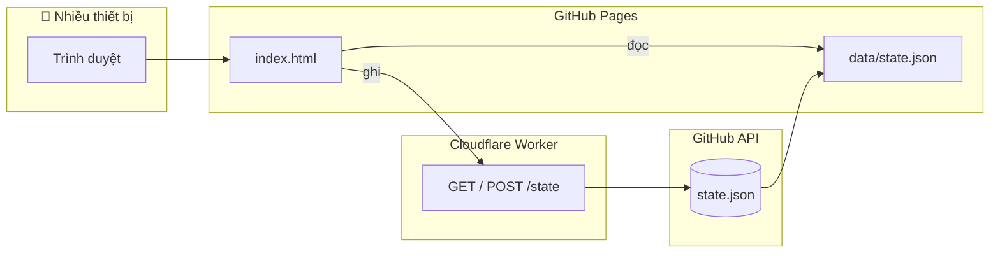

<div align="center">

# FC Mobile Cup


**Web app mini cho nhóm bạn FC Mobile** — random đội, bắt cặp, tạo giải, nhập kết quả, xem bracket, đồng bộ nhiều máy.

<br>

[](https://luan20495.github.io/fc-mobile-team-random/)
[](https://luan20495.github.io/fc-mobile-team-random/)
[](./index.html)
[](./workers/README.md)

<br>

[📖 Báo cáo vận hành](./PROJECT_REPORT.md) · [☁️ Deploy Worker](./workers/README.md) · [🤖 Agent handoff](./AGENT_HANDOFF.md)

</div>

---

## ✨ Tại sao dùng?

| | |
|:---:|:---|
| ⚡ | **Không cần cài app** — mở link, đặt tên profile, chơi ngay |
| 🎲 | **Random đội tuyển** WC 2026 (API hoặc bộ 16 đội FC Mobile) |
| 🏆 | **2 chế độ giải**: Random Cup (nhánh thắng/thua) & Giải Nhất Nhì (loại trực tiếp / vòng tròn) |
| 📊 | **BXH điểm**, profile cá nhân, thống kê thắng/thua/vô địch |
| ☁️ | **Đồng bộ nhóm** — mọi người dùng chung dữ liệu qua cloud |

> Một file `index.html`, không framework, không build step. Push `main` là có bản production.

---

## 🎮 Tính năng

<table>
<tr>
<td width="50%" valign="top">

### 🟢 Bắt đội
- Chia **1v1** hoặc **NvN** (2v2 → 5v5)
- Random **ĐTQG** cho từng người
- Lịch sử bắt đội gần đây

### 🏅 Random Cup
- Giải loại trực tiếp **thắng gặp thắng · thua gặp thua**
- Hỗ trợ **bye**, đổi ĐTQG mỗi vòng
- Bracket + nhập tỉ số nhanh

</td>
<td width="50%" valign="top">

### 🏆 Giải Nhất Nhì
- **Loại trực tiếp** (4 / 8 người) hoặc **vòng tròn + playoff**
- Bracket kiểu FC Mobile, trận **3 vs 4** sau bán kết
- **BXH tổng điểm** (Nhất +3 · Nhì +2 · Ba +1)
- Random 🎲 cặp + ĐTQG theo từng vòng

### 👤 Profile & Thống kê
- Xem lịch sử theo tên người chơi
- Bảng thống kê Random Cup & điểm giải

</td>
</tr>
</table>

---

## 🖼️ Giao diện

| Bracket giải | App tổng thể |
|:---:|:---:|
| Sơ đồ loại trực tiếp mirror, dây nối SVG, ô nhập kết quả trực tiếp | Header gọn, tab rõ, panel người chơi gập được, layout rộng trên desktop |

<sub>Mở <a href="https://luan20495.github.io/fc-mobile-team-random/">bản live</a> trên điện thoại để thêm vào màn hình chính (PWA).</sub>

---

## 🚀 Chạy local

```bash
git clone https://github.com/luan20495/fc-mobile-team-random.git
cd fc-mobile-team-random
python3 -m http.server 8765
```

Mở **http://localhost:8765** — không cần `npm install` để chạy app.

<details>
<summary><strong>Render lại icon PNG (tùy chọn)</strong></summary>

```bash
npm install
npm run icons
```

Sửa `assets/brand/app_icon.svg` rồi chạy lại lệnh trên.

</details>

---

## ☁️ Kiến trúc



| Thành phần | Vai trò |
|------------|---------|
| [`index.html`](./index.html) | SPA — UI + toàn bộ logic |
| [`data/state.json`](./data/state.json) | Database JSON dùng chung |
| [`workers/`](./workers/) | API đồng bộ, ghi qua GitHub Contents API |
| [`assets/brand/`](./assets/brand/) | Icon & brand assets |
| [`manifest.webmanifest`](./manifest.webmanifest) | PWA / Add to Home Screen |

---

## 📦 Deploy

| Layer | Cách deploy |
|-------|-------------|
| **Frontend** | Push `main` → GitHub Pages (root folder) |
| **Sync API** | `cd workers && npx wrangler deploy` — xem [workers/README.md](./workers/README.md) |
| **Backup** | Workflow `save-state.yml` (manual dispatch) |

---

## 🔐 Bảo mật

**Không commit** token, `WRITE_KEY`, hoặc `workers/.dev.vars`.

Secrets chỉ cấu hình trên Cloudflare Dashboard / GitHub Secrets.

---

## 📁 Tài liệu thêm

| File | Nội dung |
|------|----------|
| [PROJECT_REPORT.md](./PROJECT_REPORT.md) | Báo cáo vận hành, schema, checklist test |
| [AGENT_HANDOFF.md](./AGENT_HANDOFF.md) | Bàn giao kỹ thuật cho agent |
| [workers/README.md](./workers/README.md) | Deploy & cấu hình Worker |

---

<div align="center">

**FC Mobile Cup** — làm giải mini cho anh em, không cần Excel.

<br>

[](https://luan20495.github.io/fc-mobile-team-random/)

Made with ⚽ for FC Mobile squad nights

</div>
