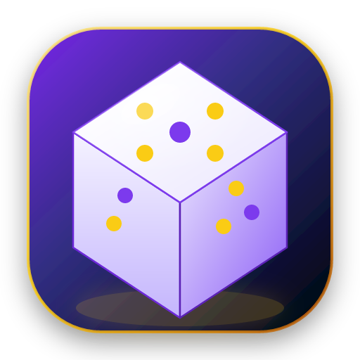
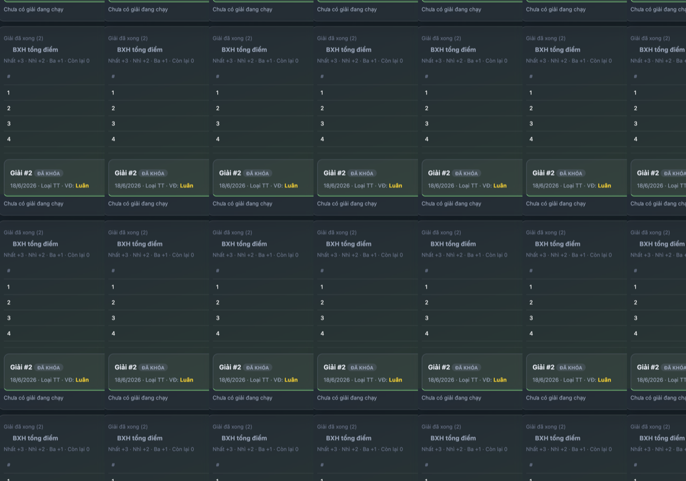
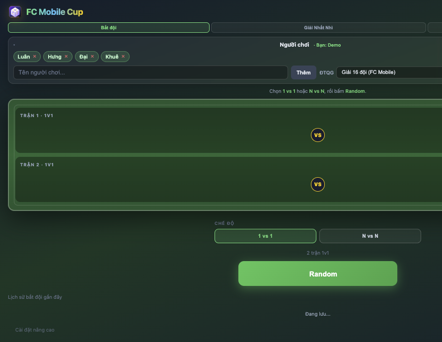
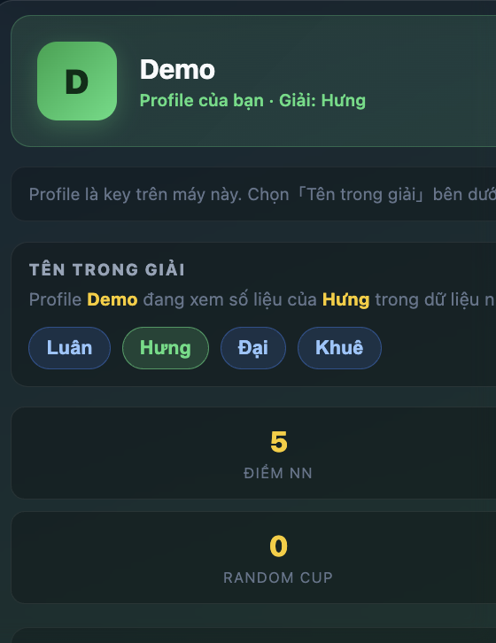
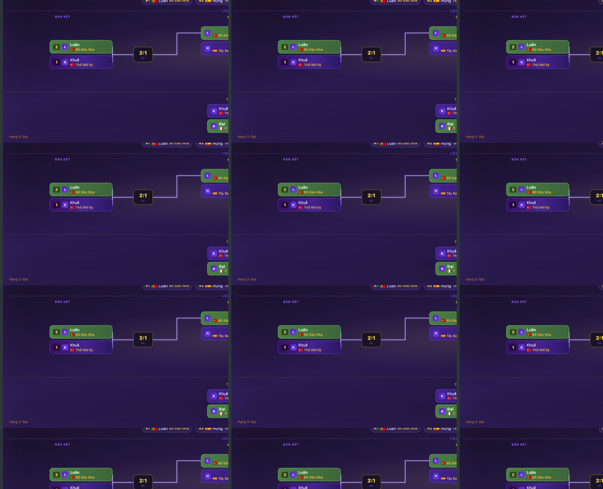
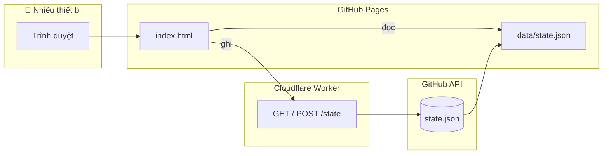

<div align="center">

# FC Mobile Cup



**Web app mini cho nhóm bạn FC Mobile** — random đội, bắt cặp, tạo giải, nhập kết quả, xem bracket, đồng bộ nhiều máy.

<br>

[](https://luan20495.github.io/fc-mobile-team-random/)
[](https://luan20495.github.io/fc-mobile-team-random/)
[](./index.html)
[](./workers/README.md)

<br>

<a href="https://luan20495.github.io/fc-mobile-team-random/">
  
</a>

<sub>👆 Bấm ảnh để mở bản live · thêm vào màn hình chính trên điện thoại (PWA)</sub>

<br><br>

[📖 Báo cáo vận hành](./PROJECT_REPORT.md) · [☁️ Deploy Worker](./workers/README.md) · [🤖 Agent handoff](./AGENT_HANDOFF.md)

</div>

---

## ✨ Tại sao dùng?

<table>
<tr>
<td width="140" align="center"></td>
<td><strong>Không cần cài app</strong> — mở link, đặt tên profile, chơi ngay. Push <code>main</code> là có bản production.</td>
</tr>
<tr>
<td align="center">🎲</td>
<td><strong>Random đội tuyển</strong> WC 2026 (API) hoặc bộ <strong>16 đội FC Mobile</strong></td>
</tr>
<tr>
<td align="center">🏆</td>
<td><strong>Giải Nhất Nhì</strong> loại trực tiếp / vòng tròn · bracket mirror + BXH điểm</td>
</tr>
<tr>
<td align="center">👤</td>
<td><strong>Profile riêng</strong> trên máy — gán nick giải để xem điểm & lịch sử</td>
</tr>
<tr>
<td align="center">☁️</td>
<td><strong>Đồng bộ nhóm</strong> qua Cloudflare Worker — mọi máy dùng chung data</td>
</tr>
</table>

---

## 🖼️ Giao diện app

<table>
<tr>
<td width="50%" valign="top">

### 🎲 Bắt đội
Random cặp 1v1 / NvN, gán cờ ĐTQG, lịch sử gần đây.

<a href="https://luan20495.github.io/fc-mobile-team-random/">
  
</a>

</td>
<td width="50%" valign="top">

### 👤 Profile
Tên profile trên máy (vd. Tứ Hùng) + chọn **tên trong giải** (Hưng, Luân…).

<a href="https://luan20495.github.io/fc-mobile-team-random/">
  
</a>

</td>
</tr>
<tr>
<td colspan="2" align="center">

### 🏆 Bracket Giải Nhất Nhì
Sơ đồ loại trực tiếp kiểu FC Mobile · dây nối SVG · nhập tỉ số trực tiếp · tranh hạng 3

<a href="https://luan20495.github.io/fc-mobile-team-random/">
  
</a>

</td>
</tr>
</table>

---

## 🎮 Tính năng chính

<table>
<tr>
<td width="33%" valign="top" align="center">

<br>
<strong>Bắt đội</strong><br>
<sub>1v1 · 2v2→5v5 · random ĐTQG</sub>

</td>
<td width="33%" valign="top" align="center">

<br>
<strong>Giải Nhất Nhì</strong><br>
<sub>Loại TT · vòng tròn · BXH +3/+2/+1</sub>

</td>
<td width="33%" valign="top" align="center">

<br>
<strong>Profile & điểm</strong><br>
<sub>Tên máy ≠ nick giải · lịch sử cá nhân</sub>

</td>
</tr>
</table>

---

## 🚀 Chạy local

```bash
git clone https://github.com/luan20495/fc-mobile-team-random.git
cd fc-mobile-team-random
python3 -m http.server 8765
```

Mở **http://localhost:8765** — không cần `npm install` để chạy app.

<details>
<summary><strong>Render lại icon PNG (tùy chọn)</strong></summary>

```bash
npm install
npm run icons
```

Sửa `assets/brand/app_icon.svg` rồi chạy lại lệnh trên.

</details>

---

## ☁️ Kiến trúc



| Thành phần | Vai trò |
|------------|---------|
| [`index.html`](./index.html) | SPA — UI + toàn bộ logic |
| [`data/state.json`](./data/state.json) | Database JSON dùng chung |
| [`workers/`](./workers/) | API đồng bộ, ghi qua GitHub Contents API |
| [`assets/brand/`](./assets/brand/) | Icon & brand assets |
| [`manifest.webmanifest`](./manifest.webmanifest) | PWA / Add to Home Screen |

---

## 📦 Deploy

| Layer | Cách deploy |
|-------|-------------|
| **Frontend** | Push `main` → GitHub Pages (root folder) |
| **Sync API** | `cd workers && npx wrangler deploy` — xem [workers/README.md](./workers/README.md) |
| **Backup** | Workflow `save-state.yml` (manual dispatch) |

---

## 🔐 Bảo mật

**Không commit** token, `WRITE_KEY`, hoặc `workers/.dev.vars`.

Secrets chỉ cấu hình trên Cloudflare Dashboard / GitHub Secrets.

---

## 📁 Tài liệu thêm

| File | Nội dung |
|------|----------|
| [PROJECT_REPORT.md](./PROJECT_REPORT.md) | Báo cáo vận hành, schema, checklist test |
| [AGENT_HANDOFF.md](./AGENT_HANDOFF.md) | Bàn giao kỹ thuật cho agent |
| [workers/README.md](./workers/README.md) | Deploy & cấu hình Worker |

---

<div align="center">

**FC Mobile Cup** — làm giải mini cho anh em, không cần Excel.

<br>

[](https://luan20495.github.io/fc-mobile-team-random/)

Made with ⚽ for FC Mobile squad nights

</div>
